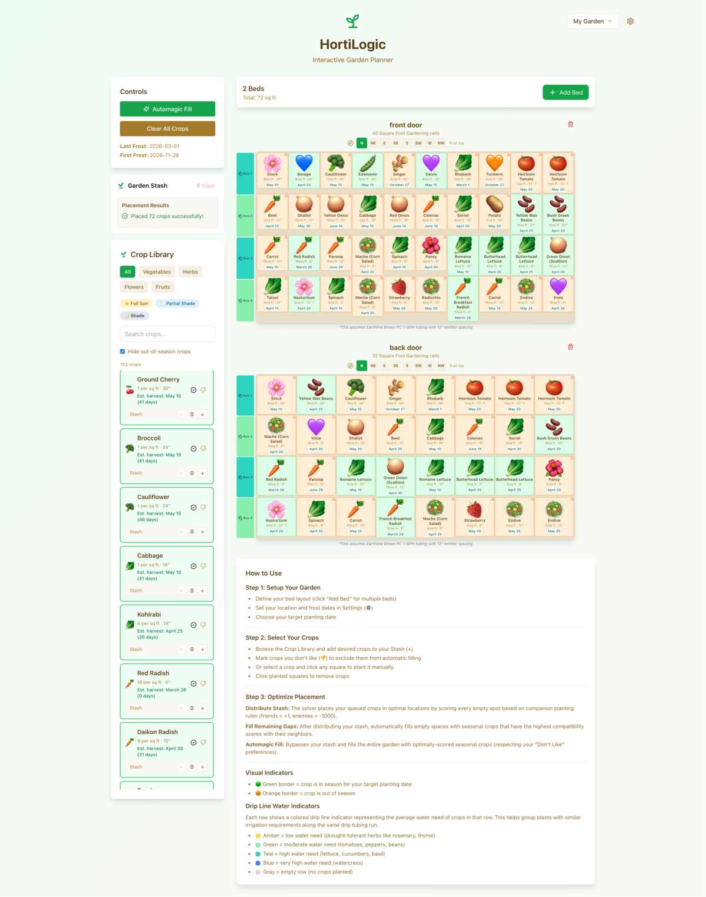

# HortiLogic

A parametric garden planner built on [Square Foot Gardening](https://squarefootgardening.org/) principles. Plan your raised beds, check crop seasonality against your local frost dates, and let the Automagic solver fill your garden with companion-friendly, season-appropriate plants.



## Features

**Interactive Garden Beds** — Click-to-plant grid based on the Square Foot Gardening method. Create multiple beds of any size (2x4 herb box, 4x8 veggie bed, you name it) and manage them all in one layout.

**Parametric Frost Date Engine** — Enter your ZIP code or frost dates and the entire app adapts. Crop viability, planting windows, and solver recommendations are all calculated relative to *your* local growing season — not hard-coded calendar months.

**Automagic Solver** — One click fills your empty squares with seasonally valid, companion-friendly crops. The solver respects enemy adjacency rules, optimizes for water-need compatibility along drip irrigation rows, balances crop diversity, and places tall crops on the north side of your beds to minimize shading.

**160+ Crop Database** — Vegetables, herbs, flowers, and fruits with SFG densities, companion planting rules (friends & enemies), planting windows, water needs, sun requirements, botanical families, and height data. Sourced from Mel Bartholomew's *Square Foot Gardening*, Louise Riotte's *Carrots Love Tomatoes*, and university extension guides.

**Drip Irrigation Awareness** — Crops are scored by water need (1-5) and the solver groups similar water needs on the same row, matching how real drip emitter tubing works. Rows are color-coded by water intensity.

**Season-Aware Crop Library** — Crops are color-coded green (plantable now), orange (needs season extension), or gray (out of season) based on your frost dates and target planting date. Toggle to hide out-of-season crops entirely.

**Layout Management** — Save multiple garden layouts (e.g., "Spring 2026", "Fall Plan"), duplicate, rename, export/import as JSON, and switch between them.

**Compass Orientation** — Set the compass direction each bed faces so the height optimizer knows which side is north for sun-blocking calculations.

**Crop Stash** — Queue up the crops you want before distributing them across your beds. The stash acts as a planning cart with area limits.

**Global Undo** — Accidentally clear a bed or auto-fill over your careful layout? Undo it.

**No Backend Required** — Everything runs in the browser and persists to LocalStorage. Your data stays on your device.

## Tech Stack

| Layer | Tool |
|-------|------|
| Language | TypeScript (strict mode) |
| Framework | React 18 + Vite |
| Styling | Tailwind CSS |
| Icons | Lucide React |
| Validation | Zod |
| Storage | LocalStorage (no backend) |
| Testing | Vitest + React Testing Library |

## Getting Started

```bash
# Clone the repo
git clone https://github.com/brooksomics/hortilogic.git
cd hortilogic

# Install dependencies
npm install

# Start the dev server
npm run dev
```

Open [http://localhost:5173](http://localhost:5173) in your browser.

### First Steps

1. Click the **Settings** gear icon and enter your ZIP code (or manually set your frost dates)
2. Browse the **Crop Library** on the left — green-bordered crops are in season
3. Click a crop, then click a grid cell to plant it
4. Or just hit **Automagic Fill** and let the solver do the work

## Commands

```bash
npm run dev              # Start dev server
npm run build            # Production build
npm run preview          # Preview production build
npm run lint             # ESLint
npm run typecheck        # TypeScript validation
npm test                 # Run all tests (504 tests across 33 suites)
npm run test:watch       # Tests in watch mode
```

## Project Structure

```
src/
├── components/          # React components (GardenBed, CropLibrary, SettingsModal, etc.)
├── context/             # GardenProvider context for global state
├── data/                # Crop database (160+ crops with full metadata)
├── hooks/               # Custom hooks (useGarden, useLayoutManager, useProfiles, etc.)
├── schemas/             # Zod validation schemas
├── types/               # TypeScript interfaces (Crop, GardenLayout, GardenBox, etc.)
└── utils/               # Pure logic (dateEngine, companionEngine, prioritySolver, etc.)
```

## How the Solver Works

The Automagic solver uses a constraint-satisfaction approach:

1. **Seasonality filter** — Only crops viable for your frost dates and target planting date are considered
2. **Companion rules** — Enemy crops are never placed adjacent to each other (up/down/left/right)
3. **Water-need grouping** — Crops on the same row are penalized for water-need variance (matching drip irrigation lines)
4. **Height optimization** — Tall and trellisable crops are placed toward the north side of beds to minimize shading
5. **Diversity scoring** — The solver favors variety across botanical families and crop types
6. **Dislike filtering** — Crops you've marked as "don't like" are excluded

## Contributing

Contributions are welcome! The project uses a TDD workflow — tests are written before code and must fail first. Run the full validation suite before submitting:

```bash
npm run lint && npm run typecheck && npm test
```

## License

[MIT](LICENSE.md)
